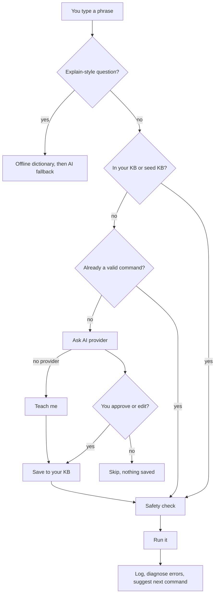

<div align="center">

# Clishe

**Say what you want. Learn the command. Keep your shell.**

An offline-first command-line companion for Linux beginners.
Type plain English, get a real shell command, and see exactly what will run before it does.
AI assistance is optional.

[](https://github.com/Sym-jay/clishe/actions/workflows/tests.yml)


[Install](#install) · [Usage](#usage) · [AI providers](#ai-providers-optional) · [How it works](#how-it-works) · [Security](#security) · [Contributing](#contributing)

</div>

---

```text
You: show me disk usage
Clishe: I know this! Running: df -h

Filesystem      Size  Used Avail Use% Mounted on
/dev/sda1        50G   12G   36G  25% /

You: find files bigger than 100MB
Clishe: I don't know that. Let me think...
Clishe (via ollama): I think you mean: find . -type f -size +100M
Run this? [Y/n/e=edit]: y
```

<!-- TODO: replace or supplement the block above with an asciinema/GIF demo once recorded -->

## Why Clishe

Most command-line tools assume you already know the command you want. Clishe assumes you don't, and treats that as normal.

- **It shows its work.** Every command is displayed before it runs, and you can edit it first.
- **It works offline.** A bundled knowledge base, a command dictionary and an error-hint database need no network and no account.
- **It learns from you.** Anything you teach it, or approve from an AI suggestion, is remembered, so the same phrase is instant next time.
- **It stays out of your way.** It's a small bash + Python (standard library) tool that keeps its files in the standard XDG locations.

## Features

**Everyday use**
- Natural language to shell commands, resolved in this order: your knowledge base, the bundled seed KB, a native command you typed directly, then an AI provider (if configured), then "teach me".
- `explain`-style questions: `explain tar -xzvf`, `what does chmod do`, `what's grep`, `tell me about find`. These use the offline dictionary first and only ask an AI provider if the command isn't in it.
- Plain-English hints when a command fails (permission denied, no such file, and so on), fully offline.
- Next-command suggestions based on your own history. They appear once you have a few dozen logged commands.

**AI (optional)**
- Local models through [Ollama](https://ollama.com), or the Anthropic API, with a configurable priority order and automatic fallback when a provider is unreachable.
- Distro-aware suggestions: your distro ID (from `/etc/os-release`) is passed to the model so it can prefer `apt`, `dnf` or `pacman` as appropriate.
- AI suggestions are saved only after you approve them. If you reject one, nothing is stored.

**Safety and scripting**
- Commands that look destructive (`rm -rf`, `mkfs`, `dd if=`, fork bombs, recursive `chmod`/`chown` on `/`) require you to type `YES`.
- One-shot mode for scripts and aliases: `clishe explain "tar -xzvf"` and `clishe "show me disk usage"` (a knowledge-base lookup that prints the command without running it).

## Install

**Requirements:** Linux, bash 4+, Python 3.9+ (standard library only), and git for the installer.

> **Windows:** use [WSL](https://learn.microsoft.com/windows/wsl/install). **macOS:** untested. The system bash (3.2) is too old and the script uses GNU `sed` features, so you'd need a newer bash and GNU sed from Homebrew.

### One-line install

```bash
curl -fsSL https://raw.githubusercontent.com/Sym-jay/clishe/main/install.sh | bash
```

This clones the repo into `~/.clishe-src` and links a `clishe` launcher into `~/.local/bin`. If that directory isn't on your `PATH`, the installer tells you what to add. To read the script before running it, [view install.sh](https://github.com/Sym-jay/clishe/blob/main/install.sh).

### Manual install

```bash
git clone https://github.com/Sym-jay/clishe.git
cd clishe
chmod +x clishe.sh clishe_brain.py
./clishe.sh
```

### Uninstall

```bash
rm -rf ~/.clishe-src ~/.local/bin/clishe
# Optional: also remove your saved data and config
rm -rf ~/.local/share/clishe ~/.config/clishe
```

## Usage

Start an interactive session:

```bash
clishe
```

Type what you want. Type `exit` to leave.

### Sessions

**A phrase Clishe already knows**
```text
You: show me disk usage
Clishe: I know this! Running: df -h
```

**A phrase it doesn't know, with an AI provider configured**
```text
You: find files bigger than 100MB
Clishe (via ollama): I think you mean: find . -type f -size +100M
Run this? [Y/n/e=edit]: e
Edit command: find ~ -type f -size +100M
```
Your edited command is the one that gets run and saved. Answering `n` skips it and saves nothing. The suggestion above is illustrative, since the exact command depends on your model.

**A phrase it doesn't know, with no AI provider**
```text
You: deploy my site
Clishe: I don't know that, and no AI provider is available right now. Teach me!
What command should I run? (blank to skip) ./deploy.sh
Clishe: Thanks! I'll remember that.
```

**Asking what something does**
```text
You: explain tar -xzvf
You: what does chmod do
You: tell me about grep
```

### One-shot mode

```bash
clishe explain "tar -xzvf"        # explain a command, then exit
clishe "show me disk usage"       # look up a phrase in your KB / seed KB (does not run it)
```

## Configuration

Clishe follows the [XDG Base Directory](https://specifications.freedesktop.org/basedir-spec/latest/) layout:

| What | Default location |
|---|---|
| Config | `~/.config/clishe/config.json` (or `$XDG_CONFIG_HOME/clishe/`) |
| Your knowledge base (phrases you taught or approved) | `~/.local/share/clishe/kb.json` (or `$XDG_DATA_HOME/clishe/`) |
| Command history (for suggestions) | `~/.local/share/clishe/history.json` |
| Seed knowledge base (bundled, read-only) | `seed_kb.json` in the install directory |

Files from older versions (`~/.clishe_kb.json` and friends) are moved to the new locations automatically on first run.

The config file is created on first run with owner-only permissions (`0600`):

```json
{
  "provider_priority": ["ollama", "anthropic"],
  "ollama": {
    "host": "http://localhost:11434",
    "model": "llama3.2"
  },
  "anthropic": {
    "api_key": "",
    "model": "claude-haiku-4-5-20251001"
  }
}
```

Providers are tried in `provider_priority` order. A provider that isn't configured or can't be reached is skipped.

## AI providers (optional)

Clishe is useful without any AI. This section is for resolving phrases it hasn't seen before.

### Local: Ollama (free, private, works offline)

1. Install [Ollama](https://ollama.com/download).
2. Pull a small model: `ollama pull llama3.2`
3. Make sure it's running (`ollama serve`, or the background service).

Clishe detects the local server automatically. No key and no network are needed.

### Cloud: Anthropic

1. Get an API key from [console.anthropic.com](https://console.anthropic.com).
2. Provide it as an environment variable (preferred, so no secret lives in a file):
   ```bash
   export ANTHROPIC_API_KEY="sk-ant-..."
   ```
   Or put it in `~/.config/clishe/config.json` under `anthropic.api_key`.

### What gets sent to a cloud provider

If you use the Anthropic provider, these are sent to its API:
- phrases you type that aren't in your KB or seed KB,
- commands you ask Clishe to `explain` that aren't in the offline dictionary,
- your distro ID (for example `ubuntu`).

Your knowledge base, command history and command output are never sent. With Ollama, nothing leaves your machine.

## How it works



## Security

Clishe runs resolved commands with `eval`, so it can do anything a shell command can. Please read this before trusting it.

- **You approve AI suggestions before they run**, and only what you approved (including your edits) is saved.
- **Destructive-looking commands need a typed `YES`.**
- **The pattern list is not exhaustive.** It catches obvious cases, not every risky command. Read what you're about to run.
- **Don't run Clishe as root.** It's alpha software.
- If you use the config file for an API key, it's created with `0600` permissions. An environment variable avoids storing the key at all.

To report a way to bypass the confirmation checks, see [SECURITY.md](SECURITY.md).

## Troubleshooting

**`clishe: command not found`**
`~/.local/bin` isn't on your `PATH`. Add `export PATH="$HOME/.local/bin:$PATH"` to your `~/.bashrc`, then restart your shell.

**"No AI provider is available"**
No provider is configured or reachable. Check that `ollama serve` is running, or that `ANTHROPIC_API_KEY` is set. Clishe still works from your KB, the seed KB and teach-me mode.

**Suggestions in the wrong package manager**
Clishe reads your distro from `/etc/os-release`. If that file is missing or unusual, the AI gets no distro hint. Rejecting a suggestion saves nothing, so you can retry.

**Errors mentioning `read -i` or `sed` on macOS**
The default macOS bash is too old, and BSD `sed` differs. See [Install](#install).

**Starting over**
Delete `~/.local/share/clishe/kb.json` to forget everything you've taught it.

## Project layout

```text
clishe.sh               interactive shell front end
clishe_brain.py         backend: KB, history, prediction, AI resolution
config.py               config loading, distro detection
knowledge.py            offline explain / diagnose engine
providers/              AI provider interface, Ollama and Anthropic backends
seed_kb.json            bundled starter phrases (read-only)
command_dictionary.json offline command explanations
error_patterns.json     offline error hints
install.sh              one-line installer
tests/                  pytest suite
```

## Roadmap

Ideas, not promises:

- Demo recording in this README
- Distro-specific entries in the offline dictionary (package managers)
- AUR and Homebrew packaging
- More dictionary and seed-KB entries
- Trimming stored history so it stays small over time

## Contributing

Contributions are welcome. [CONTRIBUTING.md](CONTRIBUTING.md) covers adding an AI provider, extending the offline dictionary and running tests.

```bash
pip install pytest
python -m pytest tests/ -v
python -m py_compile clishe_brain.py config.py providers/*.py
```

Found a safety issue? See [SECURITY.md](SECURITY.md).

## License

MIT. See [LICENSE](LICENSE).
