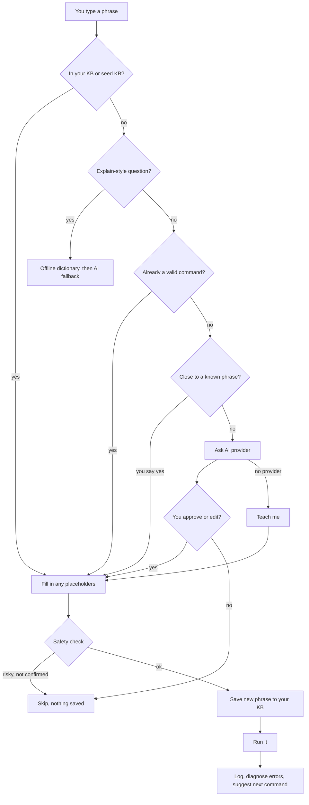

<div align="center">

# Clishe

**Say what you want. Learn the command. Keep your shell.**

An offline-first command-line companion for Linux beginners.
Type plain English, get a real shell command, and see exactly what will run before it does.
AI assistance is optional, and when you use it, it runs on your own machine.

[](https://github.com/Sym-jay/clishe/actions/workflows/tests.yml)


[Install](#install) · [Usage](#usage) · [AI providers](#ai-providers-optional) · [How it works](#how-it-works) · [Security](#security) · [Contributing](#contributing)

</div>

---

```text
You: show me disk usage
Clishe: I know this! Running: df -h

Filesystem      Size  Used Avail Use% Mounted on
/dev/sda1        50G   12G   36G  25% /

You: show file contents
Clishe: I know this! cat <file>
  file: notes.txt
Clishe: Running: cat notes.txt

You: find files bigger than 100MB
Clishe: I don't know that. Let me think...
Clishe (via ollama): I think you mean:

  find  .  -type f  -size +100M
  │     │  │        └─ bigger than 100M
  │     │  └─ only files, not folders
  │     └─ this folder
  └─ search for files in a directory hierarchy

  Searches this folder and below for files larger than 100 MB.
  ✓ every option is in the manual
Run this? [Y/n/e=edit]: y
```

<!-- TODO: record demo.gif with `vhs demo.tape` and show it here:  -->

Or skip the session entirely: type plain English at your **normal prompt** and press **Ctrl+G**. The words turn into the command, right there on your line, ready to read, edit and run.

```text
$ show me disk usage        ← press Ctrl+G
$ df -h                     ← press Enter when you're ready
```

## Why Clishe

Most command-line tools assume you already know the command you want. Clishe assumes you don't, and treats that as normal.

- **It shows its work.** Every command is displayed as it runs. AI suggestions and "did you mean...?" matches wait for your OK first (and AI suggestions can be edited), each AI suggestion comes with a one-line reason, and `explain` breaks down the exact flags you used.
- **It works offline, and stays local.** A bundled knowledge base, a command dictionary and an error-hint database need no network and no account. The AI, if you add one, is a model running on your own computer. Nothing you type is sent to the internet unless you deliberately turn on a cloud provider.
- **It learns from you.** Anything you teach it, or approve from an AI suggestion, is remembered once it has worked, so the same phrase is instant next time. A command that fails is never saved.
- **It stays out of your way.** It's a small bash + Python (standard library) tool that keeps its files in the standard XDG locations.

## Features

**Everyday use**
- Works in your normal shell: press Ctrl+G on a line of plain English and it becomes the command, with the cursor on the first blank to fill in. Press it on a real command to have it explained. It never runs anything for you. See [Your normal shell](#your-normal-shell-ctrlg).
- Mistakes you can undo: when you delete something with `rm`, Clishe offers to move it to the Trash instead (if `gio` or `trash-cli` is installed), so you can get it back.
- Helps you outgrow it: after you've asked for the same thing three times, Clishe shows you the command. The next time, it's **your turn**: Clishe asks you to type it yourself, and checks it (`ls -al` counts for `ls -la`). Once you've got it right twice, it stops asking.
- `practice`: hands-on lessons in a throwaway folder, with hints. The built-in "basics" lesson has 14 exercises (pwd, ls, mkdir, cd, touch, echo, cat, cp, mv, find, grep, rm), and it remembers where you stopped. Lessons are simple JSON files, so teachers and workshops can write their own: drop one in `~/.local/share/clishe/lessons/` and run `clishe practice <name>` (`clishe practice --list` shows them all).
- `tour`: a walk through your own computer in plain English: which Linux you run (and what it's based on), processor and memory, free disk space, desktop and shell, what folders like `/etc` and `/usr/bin` are for, how software gets installed, and whether you can use `sudo`. Each stop has a command to try, so you can find it all again yourself. Offline.
- `progress`: the everyday commands you've typed yourself, the ones you still ask for, and good ones to learn next.
- Natural language to shell commands, resolved in this order: your knowledge base, the bundled seed KB, a native command you typed directly, a close match to a phrase it already knows ("did you mean...?"), then an AI provider (if configured), then "teach me".
- Forgiving matching: case, punctuation and filler like "please" or "can you" are ignored, so `Please show me disk usage?` finds `show me disk usage`. Different wording with the same meaning gets a "did you mean...?" too (`remove a directory` → `delete a folder`).
- Fill-in-the-blank commands: entries like `cp <file> <destination>` ask for each value, quote it safely, and show the final command before running it. You can teach your own (`ssh <server>`).
- `explain`-style questions: `explain tar -xzvf`, `what does chmod do`, `what's grep`, `tell me about find`. The offline dictionary explains each flag you used (`-x`, `-z`, `-v`, `-f`). For anything else that's installed, Clishe reads **your own system's manual** (`man`, or `--help`) and picks out the lines for the flags you used, still offline. An AI is asked only when there's no manual at all.
- **Every part labelled.** AI suggestions, and known phrases the first time you use them, are drawn with each part of the command labelled underneath, using the offline dictionary and your own `man` pages. You see the shape of a command, not just a one-liner. Commands with pipes or redirects are shown the usual way.
- AI suggestions are checked against your manual, and Clishe warns if a flag isn't in it (small models sometimes invent them). You learn from the real documentation, not just the model.
- Plain-English hints when a command fails (permission denied, no such file, pip's "externally-managed-environment", apt without sudo, no internet, and more), fully offline. If a program isn't installed, it tells you the install command for your distro (`apt`, `dnf`, `pacman`, `zypper` or `apk`).
- **"How do I install Spotify?"** (also "install vs code", "get vlc"): for about 25 popular apps, Clishe knows the right way on your system. It prefers your distro's own package when there is one (it updates with everything else), otherwise Flathub, with the one-time Flatpak setup for your distro if you don't have it yet, and Homebrew on a Mac. Well-known command-line tools (`install htop`) get your package manager's command, or "it's already installed". It shows the commands and asks before running anything.
- **`fix that`** after a command fails: Clishe explains what went wrong and offers a fixed command to run (with the usual safety check). Common mistakes are fixed offline: a misspelled command (`gti` → `git`), a misspelled file or folder (`cd Documnets` → `cd Documents`), a missing `sudo`, a script that isn't executable, `cp` on a folder without `-r`, an out-of-date apt package list. Anything else goes to your local AI. It never guesses a different file name for `rm` or `mv`; it only mentions it.
- **`undo that`** reverses the last change, after showing you the command that does it: `mv` moves it back, `mkdir` removes the folder while it's empty, `touch` removes the empty file, `cp` sends the copy to the Trash, `chmod` restores the old permissions, `cd` goes back, and files moved to the Trash are put back where they were (on a Mac, Clishe tells you how to use Finder's Put Back, since macOS hides the Trash from the terminal). It checks nothing has changed since and refuses rather than guess. Package installs get the matching remove command. A plain `rm` can't be undone, and Clishe says so.
- **"Is this safe to run?"** Paste a command you found online, or point at a script: `clishe check 'curl … | sudo bash'` or `clishe check install.sh` (in a session: `is this safe: <command>` or `check <command>`). Nothing is run. You get each part explained, what it would change (files created or deleted, software installed, admin rights, which websites it talks to), any risky patterns, and for downloaded scripts a safer way: download, read, then check. It exits with 1 when there are warnings, so it works in scripts too.
- "What does this mean?" after `ls -l`, `df -h`, `free -h`, `ps aux`, `git status` and others walks you through the columns of the output you just saw. Offline, and your output never leaves your machine.
- Next-command suggestions based on your own history. They appear once you have a few dozen logged commands.
- A comfortable prompt: arrow keys and line editing work, your inputs are remembered across sessions, and Ctrl-C stops a running command without closing Clishe.
- Manage what it knows from inside a session: `learned`, `teach`, `forget <phrase>`.

**AI (optional)**
- Local models only, by default: [Ollama](https://ollama.com), or any server with an OpenAI-style API ([llama.cpp](https://github.com/ggml-org/llama.cpp)'s `llama-server`, [LM Studio](https://lmstudio.ai), [Jan](https://jan.ai), LocalAI, vLLM). Clishe finds a running server on its usual port by itself.
- Your phrases never leave your machine or local network. A model server on the internet is refused unless you set `"allow_remote_ai": true`.
- A cloud provider (Anthropic) is available as an **opt-in**: it does nothing until you set `"enabled": true`.
- Distro-aware suggestions: your distro and the distro it's based on (from `/etc/os-release`) are passed to the model, so Linux Mint gets `apt` and Fedora gets `dnf`.
- AI suggestions are saved only after you approve them and they run successfully. If you reject one, or it fails, nothing is stored.

**Safety and scripting**
- Commands that look destructive require you to type `YES`, and the warning says why in plain English ("It deletes a folder and everything inside it, permanently"). The check parses the command, so `rm -fr`, `sudo rm -r`, `cd x && rm -rf y`, `curl ... | sh`, `find -delete`, `git reset --hard` and friends are all caught. See [Security](#security).
- One-shot mode for scripts and aliases: `clishe explain "tar -xzvf"`, `clishe "show me disk usage"` (a knowledge-base lookup that prints the command without running it), `clishe --list`.

## Install

**Requirements:** Linux or macOS, bash (any version, including the 3.2 that macOS ships) and Python 3.9+ (standard library only).

> **macOS:** works with the built-in bash and zsh. Install hints use Homebrew, deleted files go to the Trash, and `clishe tour` explains your Mac. Most commands work the same as on Linux; where macOS's BSD tools differ, `explain` reads your Mac's own man pages. **Windows:** use [WSL](https://learn.microsoft.com/windows/wsl/install).

### With pipx (recommended)

[pipx](https://pipx.pypa.io) installs command-line tools in their own space, and most distros package it (`sudo apt install pipx`, `sudo dnf install pipx`, `sudo pacman -S python-pipx`). On a Mac: `brew install pipx`.

```bash
pipx install clishe
```

Update with `pipx upgrade clishe`. (`uv tool install clishe` works too, and `pipx install git+https://github.com/Sym-jay/clishe` gets the latest unreleased code.)

### With the install script

```bash
curl -fsSL https://raw.githubusercontent.com/Sym-jay/clishe/main/install.sh | bash
```

This needs git. It clones the repo into `~/.clishe-src` and links a `clishe` launcher into `~/.local/bin`. If that directory isn't on your `PATH`, the installer tells you what to add. To read the script before running it, [view install.sh](https://github.com/Sym-jay/clishe/blob/main/install.sh), or once you have Clishe, `clishe check install.sh`.

### From a clone

```bash
git clone https://github.com/Sym-jay/clishe.git
cd clishe
./clishe.sh
```

### Uninstall

```bash
pipx uninstall clishe                       # if you used pipx
rm -rf ~/.clishe-src ~/.local/bin/clishe    # if you used the install script
# Optional: also remove your saved data and config
rm -rf ~/.local/share/clishe ~/.config/clishe
```

## Usage

Start an interactive session:

```bash
clishe
```

Type what you want. Type `help` for tips, and `exit` (or Ctrl-D) to leave.

### Sessions

**A phrase Clishe already knows**
```text
You: show me disk usage
Clishe: I know this! Running: df -h
```

**A phrase that needs details**
```text
You: copy a file
Clishe: I know this! cp <file> <destination>
Clishe: This one needs some details (leave blank to cancel):
  file: my notes.txt
  destination: backup/
Clishe: Running: cp 'my notes.txt' backup/
```
Values with spaces or wildcards are quoted for you. Leaving a value blank cancels.

**Close, but not exact**
```text
You: show disk usage
Clishe: Did you mean "show me disk usage"? That runs: df -h
Use it? [Y/n]: y
```
Saying yes also remembers your wording, so next time it's instant.

**A phrase it doesn't know, with an AI provider configured**
```text
You: find files bigger than 100MB
Clishe (via ollama): I think you mean:

  find  .  -type f  -size +100M
  │     │  │        └─ bigger than 100M
  │     │  └─ only files, not folders
  │     └─ this folder
  └─ search for files in a directory hierarchy

  Searches this folder and below for files larger than 100 MB.
  ✓ every option is in the manual
Run this? [Y/n/e=edit]: e
Edit command: find ~ -type f -size +100M
```
Your edited command is the one that gets run and saved. Answering `n` skips it and saves nothing. The suggestion above is illustrative, since the exact command depends on your model.

**A phrase it doesn't know, with no AI provider**
```text
You: deploy my site
Clishe: I don't know that, and no AI provider is available right now. Teach me!
What command should I run? (blank to skip) ./deploy.sh
...
Clishe: Saved for next time - I won't need to ask again.
```
If the command fails, Clishe doesn't save it, so a wrong answer doesn't come back next time.

**Asking about the output**
```text
You: free -h
               total        used        free      shared  buff/cache   available
Mem:           7.8Gi       2.1Gi       1.2Gi       113Mi       4.5Gi       5.4Gi
You: what does this mean
Clishe: About the output of free -h
  ...
  available   what programs can actually still use. This is the number to look at.
A small 'free' is normal and fine. A small 'available' ... means you're low on memory.
```

**A program that isn't installed**
```text
You: htop
💡 'htop' isn't installed. You can probably install it with: sudo apt install htop
```

**Asking what something does**
```text
You: explain tar -xzvf
Clishe (via offline dictionary): Archives (bundles) files together, optionally with compression.
In 'tar -xzvf':
  -x  extract an archive
  -z  use gzip compression
  -v  verbose output
  -f  specify the archive filename (usually last flag before the filename)
```
`what does chmod do` and `tell me about grep` work too.

**A destructive command**
```text
You: delete a folder
Clishe: I know this! rm -r <folder>
  folder: old-project
Clishe: Running: rm -r old-project
⚠ This command looks potentially destructive:
  rm -r old-project
  - It deletes a folder and everything inside it, permanently (there's no trash bin).
Type YES to run it anyway, anything else to cancel:
```

**Deleting something, with a Trash available**
```text
You: delete a folder
Clishe: I know this! rm -r <folder>
  folder: old-project
Clishe: Move it to the Trash instead, so you can get it back? That runs: gio trash old-project
Use the Trash? [Y/n]: y
Clishe: Running: gio trash old-project
Clishe: Moved to the Trash. Changed your mind? Open Trash in your file manager.
```
Saying `n` goes back to the normal `rm`, with its usual safety check. Set `"trash": "always"` or `"never"` in the config to stop being asked.

**Learning as you go**
```text
You: show me disk usage
...
💡 You've asked for "show me disk usage" 3 times. Next time you can type it yourself: df -h
You: df -h
...
💡 Nice, you typed df -h yourself instead of asking!
```

**Your turn**
```text
You: list files
💡 Your turn! You know this one. Type the command for "list files" (or press Enter to see it):
  $ ls -al
Clishe: ✓ That's it!
```
A wrong answer just shows you the command and runs it as usual. Set `"learn_mode"` in the config to `"always"` (ask from the second time) or `"off"`.

**Practice**
```text
You: practice
Clishe: Practice time! You're in a throwaway folder, so nothing here can hurt your files.

3/14 Make a folder called notes.
practice$ mkdir notes
✓ Nice!

4/14 Go into the notes folder.
practice$ cd note
cd: note: No such file or directory
  Not yet - try again, or type 'hint'.
```

### Your normal shell (Ctrl+G)

Add this line to your `~/.bashrc` (bash) or `~/.zshrc` (zsh), then open a new terminal:

```bash
eval "$(clishe --init bash)"   # in ~/.bashrc
eval "$(clishe --init zsh)"    # in ~/.zshrc
```

Now, at any prompt:

| You type, then press Ctrl+G | What happens |
|---|---|
| `show me disk usage` | The line becomes `df -h`. Press Enter to run it. |
| `copy a file` | The line becomes `cp <file> <destination>` with the cursor on `<file>`. |
| `remove a directory` | Its closest match, `rm -r <folder>`, plus a warning about what it does. |
| `tar -xzvf backup.tgz` | Each flag is explained. Your line stays as it was. |
| something new | Asks your AI provider, if you set one up. |

Nothing runs until you press Enter. Prefer another key? Set `CLISHE_KEY` before the `eval` line: `CLISHE_KEY='\eg'` in bash or `CLISHE_KEY='^[g'` in zsh for Alt+G.

### Session commands

| Type | What it does |
|---|---|
| `help` | Show tips |
| `learned` | List the phrases you've taught |
| `teach` | Teach a phrase and its command, or fix a wrong one |
| `forget <phrase>` | Forget a phrase you taught |
| `practice [lesson]` | Hands-on exercises in a throwaway folder (`practice list` shows the lessons) |
| `progress` | The commands you've learned to type yourself |
| `setup` | Find or set up a local AI model |
| `tour` | A quick tour of your own computer |
| `explain <command>` | Explain a command and its flags |
| `what does this mean` | Explain the output of the command you just ran |
| `fix that` | Explain why the last command failed, and offer a fix |
| `undo that` | Reverse the last change (shows the command first) |
| `check <command>` / `is this safe: <command>` | What a command or script would do, without running it |
| `exit` / Ctrl-D | Leave |

### One-shot mode

```bash
clishe explain "tar -xzvf"        # explain a command, then exit
clishe "show me disk usage"       # look up a phrase in your KB / seed KB (does not run it)
clishe --list                     # the phrases you've taught, tab-separated
clishe practice [lesson]          # hands-on exercises (--list shows the lessons)
clishe progress                   # what you've learned
clishe setup                      # find or set up a local AI model
clishe tour                       # a quick tour of your computer
clishe check '<command>'          # is it safe to run? (or a script: clishe check setup.sh)
clishe --init bash                # the Ctrl+G shortcut, for your ~/.bashrc
clishe --init zsh                 # the same, for your ~/.zshrc
clishe --version
```

## Configuration

Clishe follows the [XDG Base Directory](https://specifications.freedesktop.org/basedir-spec/latest/) layout:

| What | Default location |
|---|---|
| Config | `~/.config/clishe/config.json` (or `$XDG_CONFIG_HOME/clishe/`) |
| Your knowledge base (phrases you taught or approved) | `~/.local/share/clishe/kb.json` (or `$XDG_DATA_HOME/clishe/`) |
| Command history (for suggestions, capped) | `~/.local/share/clishe/history.json` |
| What you typed at the prompt (arrow-key recall) | `~/.local/share/clishe/input_history` |
| Seed knowledge base (bundled, read-only) | `seed_kb.json` in the install directory |

Your data files are created with owner-only permissions. Files from older versions (`~/.clishe_kb.json` and friends) are moved to the new locations automatically on first run. Set `NO_COLOR=1` to turn off colors.

The config file is created on first run with owner-only permissions (`0600`):

```json
{
  "provider_priority": ["ollama", "local", "anthropic"],
  "allow_remote_ai": false,
  "trash": "ask",
  "ollama": {
    "host": "http://localhost:11434",
    "model": "llama3.2"
  },
  "local": {
    "host": "",
    "model": ""
  },
  "anthropic": {
    "enabled": false,
    "api_key": "",
    "model": "claude-haiku-4-5-20251001"
  }
}
```

Providers are tried in `provider_priority` order. A provider that isn't running, isn't turned on, or can't be reached is skipped.

`allow_remote_ai` lets `ollama` and `local` use a model server outside your computer and local network. It's off, so a mistyped host can't send your phrases to the internet.

`learn_mode` decides when Clishe asks you to type a command yourself: `"gentle"` (the default: after you've asked for it three times), `"always"` (from the second time) or `"off"`. Add it to the config to change it.

`trash` decides what happens when you delete files with `rm` and a Trash tool (`gio` or `trash-put`) is installed: `"ask"` (the default), `"always"` (use the Trash without asking) or `"never"`.

## AI providers (optional)

Clishe is useful without any AI. This section is for resolving phrases it hasn't seen before. Everything here runs on your own computer: free, private, and it works on a plane.

The quickest start is:

```bash
clishe setup
```

It checks your memory, suggests a model that fits (`llama3.2:1b`, `llama3.2` or `qwen2.5-coder:7b`), finds Ollama or any other local model server that's running, and can download the model and set it up for you. It also tells you whether anything could be sent to the internet (only if you turned on the cloud provider).

### Ollama

1. Install [Ollama](https://ollama.com/download).
2. Pull a small model: `ollama pull llama3.2`
3. Make sure it's running (`ollama serve`, or the background service).

Clishe detects the local server automatically. No key and no network are needed.

### llama.cpp, LM Studio, Jan, LocalAI, vLLM

Start the server with a model loaded, and Clishe finds it on the usual port (`8080`, `1234`, `1337` or `8000`) and uses the first model it lists. To pick a specific server or model, set them under `"local"`:

```json
"local": { "host": "http://localhost:8080", "model": "qwen2.5-3b-instruct" }
```

A small instruct model (1–3B parameters) is enough for turning phrases into commands, and runs on a laptop CPU.

### Optional: a cloud provider (Anthropic)

Off by default, because it sends what you type over the internet. To turn it on:

1. Get an API key from [console.anthropic.com](https://console.anthropic.com).
2. Set `"enabled": true` under `"anthropic"` in `~/.config/clishe/config.json`.
3. Provide the key as an environment variable (so no secret lives in a file):
   ```bash
   export ANTHROPIC_API_KEY="sk-ant-..."
   ```
   Or put it in the config under `anthropic.api_key`.

A key in your environment alone doesn't turn it on, so having `ANTHROPIC_API_KEY` set for another tool won't make Clishe use the cloud.

When it's on, these are sent to the API: phrases you type that aren't in your KB or seed KB, commands you ask Clishe to `explain` that aren't in the offline dictionary, a failed command and its error message when you ask `fix that` and no offline rule fits, and your distro name (for example `ubuntu`). Your knowledge base, command history and command output are never sent.

## How it works



## Security

Clishe runs resolved commands with `eval`, so it can do anything a shell command can. Please read this before trusting it.

- **You approve AI suggestions before they run**, and only what you approved (including your edits) is saved.
- **Destructive-looking commands need a typed `YES`,** with a plain-English reason. The check lives in `safety.py` and has its own test suite.
- **A phrase is saved only after its command passes the safety check** (or you confirm it), so cancelling a warning never leaves a risky command in your KB.
- **The check is not exhaustive.** It catches common ways to lose data, not every risky command (for example, anything hidden inside `$(...)` or a script you run). Read what you're about to run.
- **Don't run Clishe as root.** It's alpha software.
- If you use the config file for an API key, it's created with `0600` permissions. An environment variable avoids storing the key at all.

To report a way to bypass the confirmation checks, see [SECURITY.md](SECURITY.md).

## Troubleshooting

**`clishe: command not found`**
`~/.local/bin` isn't on your `PATH`. Add `export PATH="$HOME/.local/bin:$PATH"` to your `~/.bashrc`, then restart your shell.

**"No AI provider is available"**
No provider is configured or reachable. Clishe prints the underlying error under this message (for example an HTTP 401 for a bad API key). Check that `ollama serve` (or your llama.cpp / LM Studio / Jan server) is running. Clishe still works from your KB, the seed KB and teach-me mode.

**Suggestions in the wrong package manager**
Clishe reads your distro from `/etc/os-release`. If that file is missing or unusual, the AI gets no distro hint. Rejecting a suggestion saves nothing, so you can retry.

**It learned the wrong command for a phrase**
Type `teach` and enter the phrase again with the right command, or `forget <phrase>`.

**Starting over**
Delete `~/.local/share/clishe/kb.json` to forget everything you've taught it.

## Project layout

```text
clishe.sh               interactive shell front end
clishe-bind.bash        Ctrl+G shortcut for your normal bash prompt
clishe-bind.zsh         the same shortcut for zsh
clishe_brain.py         backend: KB, history, prediction, AI resolution
config.py               config loading, distro detection
knowledge.py            offline explain / diagnose engine
manual.py               reads the man pages installed on your system
breakdown.py            draws a command with each part labelled
tour.py                 clishe tour: your computer in plain English
apps.py, apps.json      "how do I install Spotify?": popular apps per distro
fix.py                  fix that: offline fixes for common mistakes
lessons.py, lessons/    practice lessons (JSON) and how they're checked
check.py                clishe check: what a command or script would do
undo.py                 undo that: notes before a change, and how to reverse it
safety.py               destructive-command check
setup_check.py          clishe setup: memory, local model servers, model suggestion
providers/              AI provider interface: Ollama, OpenAI-style local servers, Anthropic (opt-in)
seed_kb.json            bundled starter phrases (read-only)
command_dictionary.json offline command explanations
output_guides.json      offline "what does this mean?" guides
error_patterns.json     offline error hints
install.sh              one-line installer
launch.py               the clishe command when installed with pipx
packaging/aur/          Arch User Repository package
tests/                  pytest suite
```

## Roadmap

Ideas, not promises:

- Demo recording in this README
- Distro-specific entries in the offline dictionary (package managers)
- AUR and Homebrew packaging
- More dictionary and seed-KB entries

## Contributing

Contributions are welcome. [CONTRIBUTING.md](CONTRIBUTING.md) covers adding an AI provider, extending the offline dictionary and running tests.

```bash
pip install pytest
python -m pytest tests/ -v
bash tests/test_shell_functions.sh
```

Found a safety issue? See [SECURITY.md](SECURITY.md).

## License

MIT. See [LICENSE](LICENSE).
